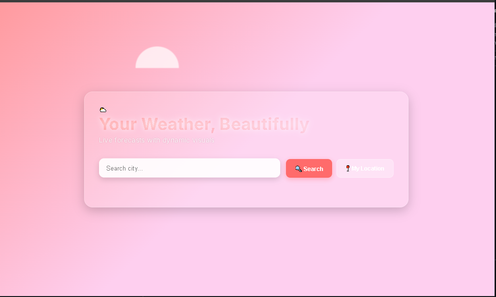

# 🌤️ Dynamic Weather App

> A beautiful, animated, and fully responsive weather web app built with **HTML, CSS, and JavaScript**.  
> Features real-time forecasts, geolocation, dynamic backgrounds, floating clouds, cinematic animations, and PWA support!

  
*(Replace this with your actual screenshot!)*

---

## 🌟 Features

- 🔍 **Search by City** — Get weather for any location
- 📍 **Use My Location** — Auto-detect your current weather
- 📈 **Current Weather + Icon** — Big, beautiful animated icons
- ⏰ **Hourly Forecast** — Next 24 hours, scrollable cards
- 📅 **7-Day Forecast** — Daily outlook with animations
- 🎨 **Dynamic Backgrounds** — Changes color based on weather (sunny, rainy, stormy, snowy, night)
- ☁️ **Animated Floating Clouds** — Background clouds that drift and change with weather
- 🎬 **Cinematic Text Animations** — Letter-by-letter reveal, glowing gradients
- 📱 **Fully Responsive** — Works on mobile, tablet, desktop
- 🚀 **PWA Ready** — Install as an app on your phone or desktop
- 🧭 **Offline Support** — Service worker caches core files
- 🎯 **Enter Key Support** — Press Enter to search — no mouse needed!
- 🌀 **Smooth Micro-interactions** — Hover effects, button ripples, card lifts

---


---

## 🛠️ How to Run Locally

### Prerequisites

- [Git](https://git-scm.com/)
- [VS Code](https://code.visualstudio.com/) (recommended)
- Live Server Extension (in VS Code)
- Free [OpenWeatherMap API Key](https://openweathermap.org/api)

### Steps

1. **Clone this repo** (or download ZIP and extract):
   ```bash
   git clone https://github.com/your-username/weather-app.git
   cd weather-app
